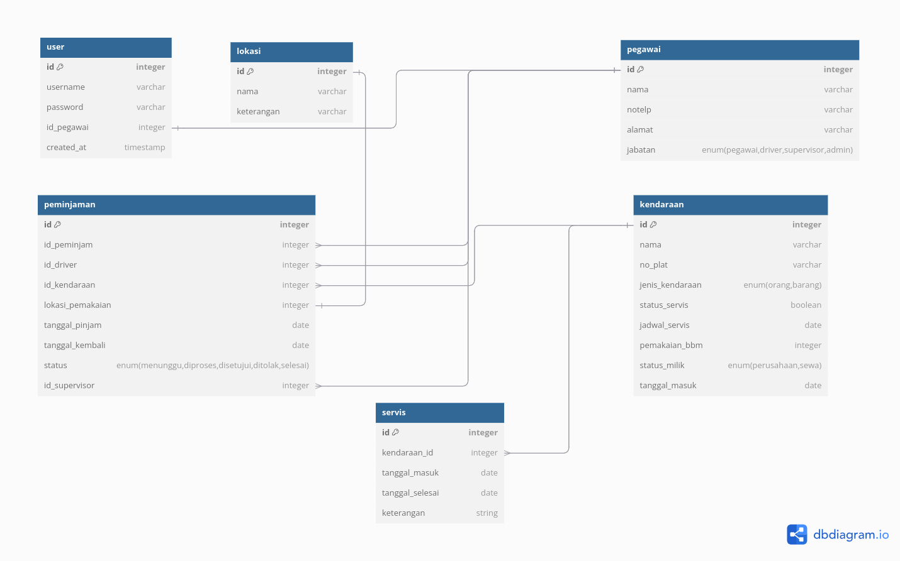

## Panduan Penggunaan Aplikasi

## Catatan

<li>PHP VERSION 8.3.11
<li>Laravel 11
<li> XAMPP(LAMPP) 8.1.6
<li> PDM

## Instalasi

<li>run git clone https://github.com/fighaz/sekawan-tes.git
<li>run composer install 
<li>copy .env.example to .env
<li>run cp .env.example .env
<li>run php artisan key:generate
<li>set up  database di .env dan buat database baru bernama sekawan_test
<li>run php artisan migrate --seed
<li>run php artisan serve
<li>klik http://localhost:8000 or http://127.0.0.1:8000.

## List Username dan Password:

1. 'username' => 'admin',
   'password' => 'password'
2. 'username' => 'supervisor1',
   'password' => 'password',
3. 'username' => 'supervisor2',
   'password' => 'password',
4. 'username' => 'supervisor3',
   'password' => 'password',

## ADMIN

-   Login dengan dengan akun yang memiliki role admin

### DASHBOARD

-   Tampilan dashboard yang menampilkan informasi umum Chart
-   Berisi kendaraan yang availble
-   Dibawah Chart terdapat akses untuk meminjam kendaraan dan untuk servis kendaraan
-   Di bagian atas kanan digunakan untuk mengeksport table Pemesanan

### KENDARAAN

-   Tambah Kendaraan
    -   Klik tombol Tambah Kendaraan
    -   Isi form yang tersedia
    -   Kirim data
-   Edit Pengajuan Peminjaman
    -   Klik tombol Ubah
    -   Isi form yang tersedia
    -   Kirim data

### PEMESANAN

-   Klik tombol pemesanan
-   Berisi semua pesanan
-   Di pojok atas bisa melakukan ekspor pemesanan

### PEMESANAN DIPROSES

-   Klik tombol pemesanan
-   Berisi semua pesanan yang sedang tahap pemrosesan di supervisor
-   Setelah dikonfirmasi Supervisor bisa untuk di konfirmasi sehingga kendaraan dapat dipakai

### Servis

-   Klik tombol Servis
-   Berisi semua kendaraan yang sedang servis
-   Setelah dikonfirmasi selesai maka kendaraan bisa digunakan kembali

## Supervisor

### KENDARAAN

-   Supervisor hanya bisa melihat kendaraan

### PEMESANAN

-   Berisi Semua Pesanan
-   Di bagian Pesanan Supervisor bisa mngkonfirmasi pesanan
